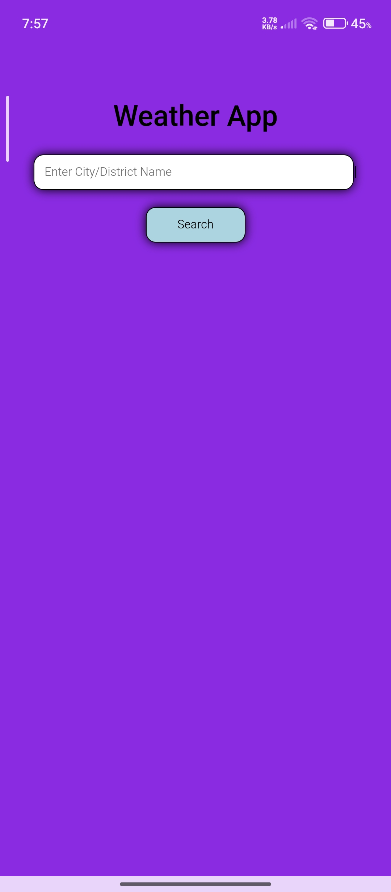
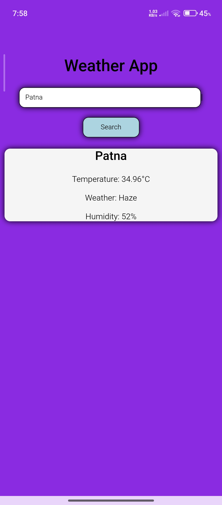

# 🌦️ WeatherNow — Modern Glassmorphic Weather Application

[](https://kotlinlang.org)
[](https://developer.android.com)
[](#)
[](#)

A premium, modern weather application built with a hybrid architecture. It integrates a native **Android Kotlin WebView container** wrapping a gorgeous, responsive **HTML5/CSS3/JavaScript (ES6)** web application. 

The user interface uses state-of-the-art **Glassmorphic Design Principles**, presenting real-time weather information with dynamic backgrounds and animations that change contextually based on the queried city's local time and current weather state.

---

## ✨ Key Features

- 🔍 **Universal City Search**: Get real-time weather data for any city, town, or district worldwide.
- 🎨 **Dynamic Glassmorphic Theme**: A modern blur-glass UI overlaying gradient backgrounds that transition smoothly depending on the weather conditions:
  - ☀️ **Sunny / Clear Day**: Golden amber gradients.
  - 🌙 **Clear Night**: Deep midnight cosmic indigo gradients.
  - ☁️ **Cloudy / Overcast**: Soft slate-grey gradients.
  - 🌧️ **Rainy / Drizzle**: Cool dark ocean slate.
  - ⛈️ **Thunderstorm**: Dramatic deep violet/grey.
  - ❄️ **Snowy**: Icy cyan-lavender frosty gradient.
- ❄️ **Ambient Weather Particle Engine**: Background physics particles matching the weather (dripping rain streaks, falling snow flakes, twinkling night stars, or gentle warm/cool floating light bubbles).
- 🧭 **Detailed Meteorological Dashboard**:
  - **Temperature**: Dynamic min/max ranges and real-time "Feels Like" calculations.
  - **Humidity**: Clean percentage layout mapped to an animated progress bar.
  - **Wind Speed & Direction**: Real-time compass widget with a rotating direction needle reflecting the wind's heading.
  - **Atmospheric Pressure**: Displayed in standard hectopascals (hPa).
  - **Visibility**: Dynamic calculation converted from meters into kilometers (km).
  - **Local Sunrise/Sunset**: Automatically shifts the UTC times using the queried city's specific timezone offset to present exact local times.
- ⚡ **Interactive City Chips**: Quick search buttons for major global/regional hubs (Delhi, Mumbai, London, Tokyo, New York).
- 📱 **Fully Responsive Layout**: Fits perfectly as a native Android app screen or in any mobile/desktop browser.

---

## 🛠️ Technology Stack

- **Frontend Core**:
  - HTML5 (Semantic Structure)
  - CSS3 (Custom Variables, Flexbox/Grid, Glassmorphism, CSS Transitions & Keyframe Animations)
  - JavaScript ES6 (Async/Await Fetch API, Timezone offset calculations, Dynamic DOM binding, Particle system generator)
- **Native Android Wrapper**:
  - Kotlin (Activity & Compose settings)
  - Jetpack Compose (Modern Compose `AndroidView` wrapper for native performance)
  - Android System WebView (JavaScript-enabled, hardware accelerated)
  - Permissions: Internet Access (`android.permission.INTERNET`)

---

## 📸 Screenshots

<p align="center">
  
  
  
</p>

---

## 🚀 Setup & Execution

### Running in Browser (Web)
1. Clone this repository to your local machine:
   ```bash
   git clone https://github.com/your-username/Weather-App.git
   ```
2. Navigate to the web assets folder:
   ```bash
   cd Weather-App/app/src/main/assets
   ```
3. Open `index.html` in any modern web browser (Chrome, Firefox, Safari, Edge).

### Running in Android Studio (Mobile)
1. Launch **Android Studio**.
2. Select **Open** and point it to the root directory `Weather-App`.
3. Allow Gradle to sync dependencies.
4. Connect an Android Device (via USB Debugging) or start a Virtual Emulator (AVD).
5. Press the **Run** button (`Shift + F10`) to compile and launch the app.

---

## 🔌 API Configuration

The application retrieves weather conditions via the [OpenWeatherMap API](https://openweathermap.org/api).
A pre-configured development API key is included in the project resources. For production release, please replace the `apiKey` variable in `app/src/main/assets/script.js` with your personal API key:

```javascript
// Replace with your personal API Key
const apiKey = "YOUR_OPENWEATHERMAP_API_KEY";
```

---

## 📁 Project Architecture

```text
Weather-App/
├── app/
│   ├── src/
│   │   └── main/
│   │       ├── AndroidManifest.xml (Internet permission & configuration)
│   │       ├── assets/
│   │       │   ├── index.html     (Structured layout widgets)
│   │       │   ├── style.css      (Glassmorphic layouts, dynamic gradients)
│   │       │   └── script.js      (Data fetcher, particle animations, metric updates)
│   │       └── java/com/gp/weatherapp/
│   │           └── MainActivity.kt (Kotlin Compose WebView engine wrapper)
│   └── build.gradle.kts
├── settings.gradle.kts
└── README.md (Documentation)
```

---

## 📄 License

This repository is licensed under the MIT License - see the LICENSE file for details. Created for learning and educational purposes.
